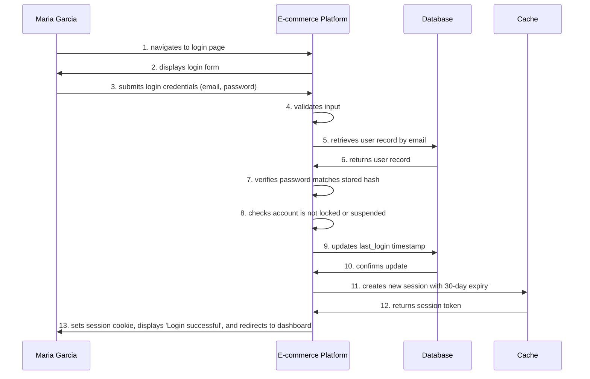

# 🚀 E-Commerce Demo: MUCM in Action

> **Watch documentation write itself.** No templates to fight. No copy-paste chaos. Just describe your system and MUCM generates *everything*.

## What You're Looking At

This is a real e-commerce authentication system documented entirely through **MUCM**. In 10 minutes, we created:

- **2 complete use cases** with multiple scenarios (happy paths, exceptions, OAuth flows)
- **11 actor profiles** (personas + system actors) with full metadata
- **Auto-generated test stubs** with safe zones for your custom code
- **Interactive Mermaid diagrams** showing every step of user flows
- **Cross-linked documentation** that actually stays in sync

**Zero manual markdown.** **Zero documentation drift.** Just pure automation.

---

## 🎯 Features You'll See Here

### 1️⃣ **Use Cases with Smart Links**

Check out [`UC-AUTH-002`](docs/use-cases/authentication/UC-AUTH-002/UC-AUTH-002-developer-normal.md) (User Login):

```toml
[[preconditions]]
text = "User must have a registered account||UC:UC-AUTH-001:depend"
```

MUCM auto-converts that to:  
→ *User must have a registered account* **([UC-AUTH-001](../../authentication/UC-AUTH-001/README.md))**

**Clickable. Cross-referenced. Automatic.**

---

### 2️⃣ **Multiple Methodology Views**

Same use case, different perspectives:

- **[UC-AUTH-001-developer-advanced.md](docs/use-cases/authentication/UC-AUTH-001/UC-AUTH-001-developer-advanced.md)** → API endpoints, database schemas, security requirements
- **[UC-AUTH-001-tester-advanced.md](docs/use-cases/authentication/UC-AUTH-001/UC-AUTH-001-tester-advanced.md)** → Test data, coverage areas, automation status

One TOML file → Multiple tailored docs. No duplication. Ever.

---

### 3️⃣ **Editable Tests with Safe Zones**

Generated test: [`tests/use-cases/authentication/uc_auth_001.py`](tests/use-cases/authentication/uc_auth_001.py)

```python
class Testuser_registration(unittest.TestCase):
    def setUp(self):
        # =============================================================================
        # START USER IMPLEMENTATION - Add your setup code here
        # =============================================================================

        # TODO: Add any setup code needed for all tests
        pass

        # =============================================================================
        # END USER IMPLEMENTATION
        # =============================================================================
```

**Write your test logic between the markers.** Regenerate docs 100 times. **Your code survives.**

---

### 4️⃣ **Live Mermaid Diagrams**

Every scenario gets a sequence diagram. Example from UC-AUTH-002-S01:



**Auto-generated from scenario steps.** No manual diagram tools. Just describe the flow.

---

### 5️⃣ **Rich Actor Profiles**

Personas aren't just names. See [`regular-customer-sarrah-chen.md`](docs/actors/regular-customer-sarrah-chen.md):

```markdown
# 👤 Sarah Chen

**ID:** `regular-customer-sarrah-chen`  
**Type:** Persona

## Background
32-year-old marketing professional who shops online 2-3 times per month. 
Prefers mobile shopping during commute. Values fast checkout and reliable delivery.

## Job Role
Marketing Professional

## Motivation for Product
Find products quickly, complete purchases securely, track orders easily
```

System actors too: [`database.md`](docs/actors/database.md), [`email-service.md`](docs/actors/email-service.md)

**Every actor → Full profile. Automatically linked in scenarios.**

---

## 🎨 How We Built This

### Interactive CLI Mode

```bash
$ mucm interactive
> 📁 Manage Use Cases
  > 🆕 Create New Use Case
    Title: User Registration
    Category: Authentication
    Priority: High
    Methodology: Developer (Advanced)
    
  > 🎬 Add Scenario
    Type: Main Flow
    Title: Successful User Registration
    
    > 📝 Add Step
      Actor: Guest User
      Action: navigates to registration page
      Target: E-commerce Platform
```

**Or edit TOML directly:**

```toml
# use-cases-data/authentication/UC-AUTH-001.toml
id = "UC-AUTH-001"
title = "User Registration"
category = "authentication"
description = "Allow new users to create an account..."

[[scenarios]]
id = "UC-AUTH-001-S01"
title = "Successful User Registration"
scenario_type = "main"

[[scenarios.steps]]
order = 1
actor = "guest"
action = "navigates to registration page"
target = "e-commerce-platform"
```

**Save. Run `mucm regenerate`. Done.**

---

## 📂 What's Inside

```
ecommerce-demo/
├── docs/
│   ├── actors/                    # 11 actor profiles (personas + systems)
│   │   ├── guest-guest-user.md
│   │   ├── database.md
│   │   └── ...
│   └── use-cases/
│       └── authentication/        # 2 use cases, multiple views each
│           ├── UC-AUTH-001/       # User Registration
│           │   ├── UC-AUTH-001-developer-advanced.md
│           │   └── UC-AUTH-001-tester-advanced.md
│           └── UC-AUTH-002/       # User Login
│               └── UC-AUTH-002-developer-normal.md
├── tests/
│   └── use-cases/
│       └── authentication/        # Auto-generated test stubs
│           ├── uc_auth_001.py     # 5 scenario tests
│           └── uc_auth_002.py     # 1 scenario test
└── use-cases-data/
    └── authentication/            # Source of truth (TOML)
        ├── UC-AUTH-001.toml       # 200+ lines of structured data
        └── UC-AUTH-002.toml
```

---

## 🔥 The Killer Features

| Feature | What It Does |
|---------|-------------|
| **Smart Links** | `||UC:UC-XXX-001:depend` → Auto-generates markdown links |
| **Safe Zones** | Custom test code survives regeneration |
| **Multi-View** | Same use case → Developer docs, tester docs, business docs |
| **Mermaid Auto-Gen** | Scenario steps → Instant sequence diagrams |
| **Actor System** | Track personas AND system actors with full profiles |
| **TOML Source** | Edit structured data, not brittle markdown |
| **Interactive CLI** | Build complex use cases without touching files |

---

## 🎯 Try It Yourself

1. **Browse the docs**: Start at [`docs/use-cases/README.md`](docs/use-cases/README.md)
2. **Check a use case**: [`UC-AUTH-001`](docs/use-cases/authentication/UC-AUTH-001/UC-AUTH-001-developer-advanced.md)
3. **See the TOML**: [`use-cases-data/authentication/UC-AUTH-001.toml`](use-cases-data/authentication/UC-AUTH-001.toml)
4. **Peek at tests**: [`tests/use-cases/authentication/uc_auth_001.py`](tests/use-cases/authentication/uc_auth_001.py)
5. **Meet the actors**: [`docs/actors/`](docs/actors/)

**Edit any TOML. Run `mucm regenerate`. Watch everything update.**

---

## 💡 Why This Matters

**Before MUCM:**
- Write use case in Word → Copy to Jira → Update Confluence → Email to QA → Maintain 4 versions
- Test team writes separate test docs → Devs ignore them → Documentation drifts
- Add a new scenario → Update 3 files manually → Miss cross-references → Links break

**After MUCM:**
- Write once in TOML (or use interactive CLI)
- Generate docs for dev, QA, business — all linked, all in sync
- Tests auto-scaffold with protected zones for your code
- Add scenarios → `mucm regenerate` → Everything updates with perfect references

**This isn't documentation. It's a documentation *compiler*.**

---

## 🛠️ Try It Yourself

**Prerequisites:** Install MUCM (`cargo install mucm`)

**Modify and experiment:**
1. Edit `use-cases-data/authentication/UC-AUTH-001.toml` directly or run `mucm -i` to use the interactive mode
2. Make the desired changes (e.g., update descriptions, add steps, modify actors)  
3. Run `mucm regenerate`
4. Watch all docs, tests, and diagrams update automatically

---

## 🚀 Next Steps

Want to see more? Check out:
- [Main MUCM Docs](../../docs/README.md) — Full feature guide
- [CLI Reference](../../docs/guides/cli/cli-reference.md) — All commands
- [Template Customization](../../docs/guides/customization/template-customization.md) — Make it yours

**Questions?** Join the [discussions](https://github.com/Guillaumecoi/MD-usecase-manager/discussions) · **Found a bug?** [Open an issue](https://github.com/Guillaumecoi/MD-usecase-manager/issues) · **Want to contribute?** PRs welcome!

**Now go automate your documentation. You'll never go back.**
