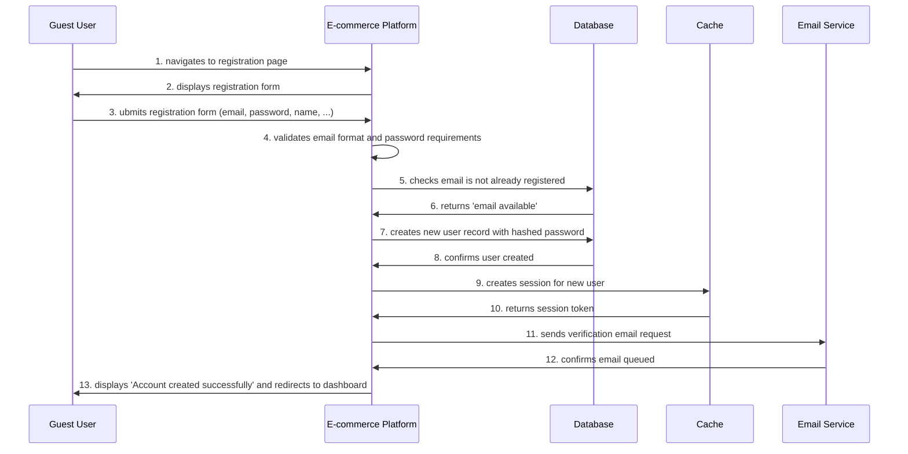

# Technical Specification: User Registration

**Use Case ID:** UC-AUTH-001  
**Implementation Status:**   
**Development Priority:** High  
**Specification Date:** 03/12/2025

---

## Technical Overview
Allow new users to create an account on the e-commerce platform by providing email, password, and basic profile information. The system validates input, checks for existing accounts, creates the user record, and sends a verification email.

### API Endpoints
- &#x60;POST /api/v1/auth/register&#x60; - Email/password registration
- &#x60;POST /api/v1/auth/register/oauth&#x60; - OAuth social registration

### Database Tables
- users
- sessions
- email_verifications

## Security Considerations
- HTTPS required for all registration requests
- CSRF token validation on form submission
- Rate limiting to prevent account creation spam
- Password strength enforced on both client and server sides
- Email verification required before checkout
- Block disposable email domains
- bcrypt password hashing with cost factor 12
- Session tokens: 32-byte random, hex-encoded

## Technical Dependencies
- PostgreSQL 14+: for user data storage
- Redis 6+: for session management
- SendGrid API: for email delivery
- OAuth providers (Google, Facebook) for social registration

## Error Scenarios
- Email already in use: return 409 Conflict
- Weak password: return 400 Bad Request with validation errors
- Invalid email format: return 400 Bad Request
- OAuth provider error: return 502 Bad Gateway
- Database connection failure: return 503 Service Unavailable

## Preconditions
- User must have a valid email address
- User does not already have an account

## Postconditions
- User account created in database
- Verification email sent to user&#x27;s email address
- User logged in with unverified status
- Session created and stored in cache
- User can access basic platform features (but not checkout until verified)

## UC-AUTH-001-S01 - Successful User Registration

**Primary Actor:** [Guest User](../../../docs/personas/guest-guest-user.md)

**Supporting Actors:** [Database](../../../docs/personas/database.md), [E-commerce Platform](../../../docs/personas/e-commerce-platform.md), [Cache](../../../docs/personas/cache.md), [Email Service](../../../docs/personas/email-service.md)

### Steps
1. **Guest User** → **E-commerce Platform**: navigates to registration page
2. **E-commerce Platform** → **Guest User**: displays registration form
3. **Guest User** → **E-commerce Platform**: ubmits registration form (email, password, name, ...)
4. **E-commerce Platform**: validates email format and password requirements
5. **E-commerce Platform** → **Database**: checks email is not already registered
6. **Database** → **E-commerce Platform**: returns &quot;email available&quot;
7. **E-commerce Platform** → **Database**: creates new user record with hashed password
8. **Database** → **E-commerce Platform**: confirms user created
9. **E-commerce Platform** → **Cache**: creates session for new user
10. **Cache** → **E-commerce Platform**: returns session token
11. **E-commerce Platform** → **Email Service**: sends verification email request
12. **Email Service** → **E-commerce Platform**: confirms email queued
13. **E-commerce Platform** → **Guest User**: displays &quot;Account created successfully&quot; and redirects to dashboard

---

**Last Updated:** 05/12/2025
