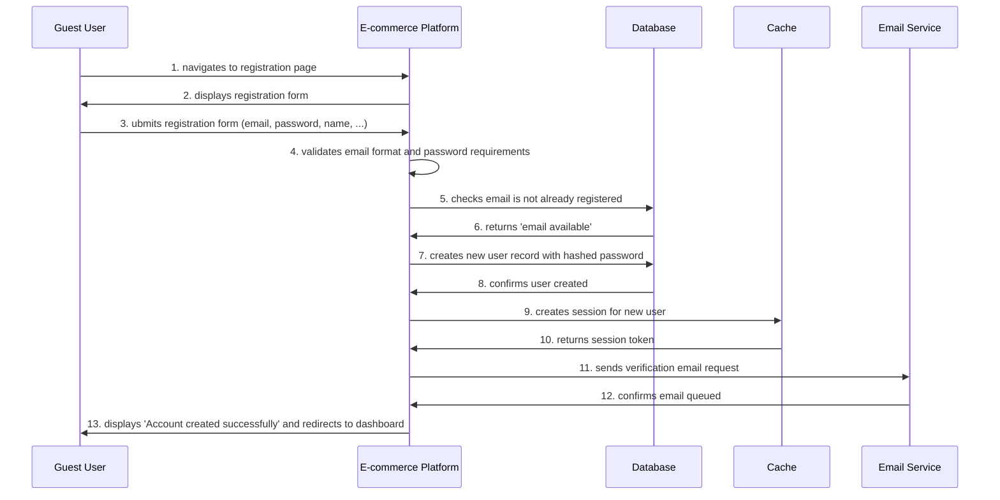

# Test Specification: User Registration

**Use Case ID:** UC-AUTH-001  
**Test Status:**   
**Test Priority:** High  
**Test Plan Date:** 03/12/2025

---

**Test Type:** [e2e, integration, security, accessibility]  
**Priority:** P0-Critical  
**Test Environments:**
- Staging environment with email service integration
- Database with clean state before each test run
- Mock OAuth providers for social registration tests
- Various browsers and devices for front-end validation tests

### Coverage Areas
- Input validation (client-side and server-side)
- Database record creation and integrity
- Email delivery and content verification
- Session creation and management
- OAuth registration flows
- Security measures (CSRF, rate limiting, password hashing)
- Accessibility (WCAG 2.1 AA compliance)

## Preconditions
- User must have a valid email address
- User does not already have an account

## Postconditions
- User account created in database
- Verification email sent to user&#x27;s email address
- User logged in with unverified status
- Session created and stored in cache
- User can access basic platform features (but not checkout until verified)

## UC-AUTH-001-S01 - Successful User Registration

**Primary Actor:** [Guest User](../../../personas/guest-guest-user.md)

**Supporting Actors:** [Database](../../../personas/database.md), [E-commerce Platform](../../../personas/e-commerce-platform.md), [Cache](../../../personas/cache.md), [Email Service](../../../personas/email-service.md)

### Steps
1. **Guest User** → **E-commerce Platform**: navigates to registration page
2. **E-commerce Platform** → **Guest User**: displays registration form
3. **Guest User** → **E-commerce Platform**: ubmits registration form (email, password, name, ...)
4. **E-commerce Platform**: validates email format and password requirements
5. **E-commerce Platform** → **Database**: checks email is not already registered
6. **Database** → **E-commerce Platform**: returns &quot;email available&quot;
7. **E-commerce Platform** → **Database**: creates new user record with hashed password
8. **Database** → **E-commerce Platform**: confirms user created
9. **E-commerce Platform** → **Cache**: creates session for new user
10. **Cache** → **E-commerce Platform**: returns session token
11. **E-commerce Platform** → **Email Service**: sends verification email request
12. **Email Service** → **E-commerce Platform**: confirms email queued
13. **E-commerce Platform** → **Guest User**: displays &quot;Account created successfully&quot; and redirects to dashboard

## Test Data Requirements
10 valid email addresses for testing (test+1@example.com through test+10@example.com), 5 known registered emails for duplicate testing, mock SendGrid API with configurable responses (success, failure, timeout), database with clean state before each test run.

## Test Environments
- Staging environment with email service integration
- Database with clean state before each test run
- Mock OAuth providers for social registration tests
- Various browsers and devices for front-end validation tests

## Coverage Areas
- Input validation (client-side and server-side)
- Database record creation and integrity
- Email delivery and content verification
- Session creation and management
- OAuth registration flows
- Security measures (CSRF, rate limiting, password hashing)
- Accessibility (WCAG 2.1 AA compliance)

---

**Last Updated:** 05/12/2025
