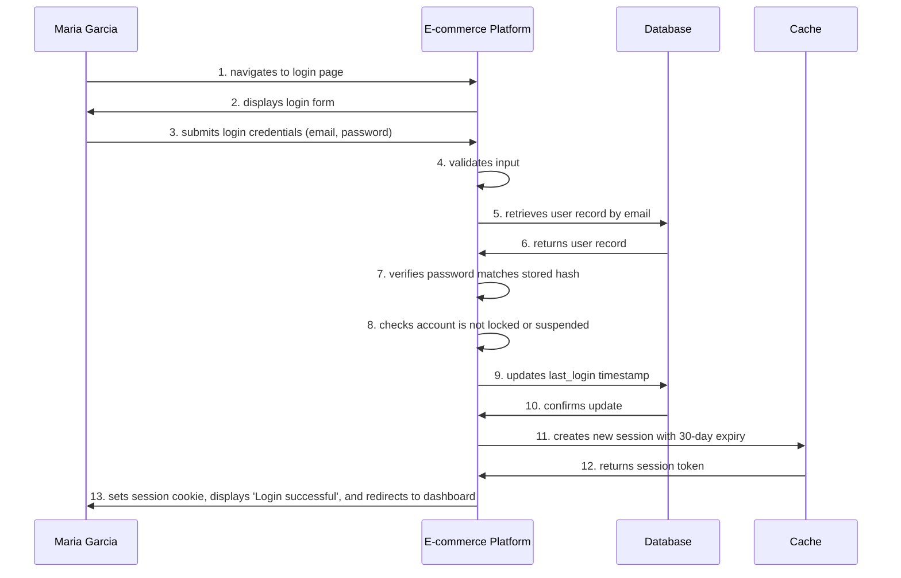

# Test Specification: User Login

**Use Case ID:** UC-AUTH-002  
**Test Status:** PLANNED  
**Test Priority:** Critical  
**Test Plan Date:** 07/12/2025

---

**Test Type:** [e2e]  
**Regression Suites:**
- Authentication &amp; Session Management Regression Suite
- Security Test Suite
- Smoke Test Suite

### Coverage Areas
- Input validation (client-side and server-side)
- Password verification (bcrypt constant-time comparison)
- Session management (create, store, retrieve, invalidate)
- Cookie handling (httpOnly, secure, sameSite attributes)
- Account lockout mechanism
- Rate limiting
- OAuth flow
- Error handling and user feedback

## Preconditions
- User must have a registered account ([UC-AUTH-001](../../authentication/UC-AUTH-001/README.md))
- User must have valid credentials
- User is authenticated and logged in

## Postconditions
- User is authenticated and logged in
- Session created and stored in cache
- Session cookie set in browser
- User redirected to dashboard or previous page
- Last login timestamp updated in database

## Scenarios (quick overview)

| ID | Title | Status |
|---|---|---|
| [UC-AUTH-002-S01]() | Successful Login with Email and Password | 📋 deployed |

## UC-AUTH-002-S01 - Successful Login with Email and Password

**Primary Actor:** [Maria Garcia](../../../actors/customer-support-agent-maria-garcia.md)

**Supporting Actors:** [E-commerce Platform](../../../actors/e-commerce-platform.md), [Database](../../../actors/database.md), [Cache](../../../actors/cache.md)

### Steps
1. **Maria Garcia** → **E-commerce Platform**: navigates to login page
2. **E-commerce Platform** → **Maria Garcia**: displays login form
3. **Maria Garcia** → **E-commerce Platform**: submits login credentials (email, password)
4. **E-commerce Platform**: validates input
5. **E-commerce Platform** → **Database**: retrieves user record by email
6. **Database** → **E-commerce Platform**: returns user record
7. **E-commerce Platform**: verifies password matches stored hash 
8. **E-commerce Platform**: checks account is not locked or suspended
9. **E-commerce Platform** → **Database**: updates last_login timestamp
10. **Database** → **E-commerce Platform**: confirms update
11. **E-commerce Platform** → **Cache**: creates new session with 30-day expiry
12. **Cache** → **E-commerce Platform**: returns session token
13. **E-commerce Platform** → **Maria Garcia**: sets session cookie, displays &quot;Login successful&quot;, and redirects to dashboard

## Test Data Requirements
20 test user accounts with known credentials, 5 locked accounts for testing lockout scenarios, 3 OAuth test accounts (Google sandbox), mock Redis cache for session testing, database with known user records and varied account states.

## Regression Suites
- Authentication &amp; Session Management Regression Suite
- Security Test Suite
- Smoke Test Suite

## Coverage Areas
- Input validation (client-side and server-side)
- Password verification (bcrypt constant-time comparison)
- Session management (create, store, retrieve, invalidate)
- Cookie handling (httpOnly, secure, sameSite attributes)
- Account lockout mechanism
- Rate limiting
- OAuth flow
- Error handling and user feedback

---

**Last Updated:** 07/12/2025

---

**Navigation:** [← Back to Authentication](../README.md) | [← Back to All Use Cases](../../README.md)